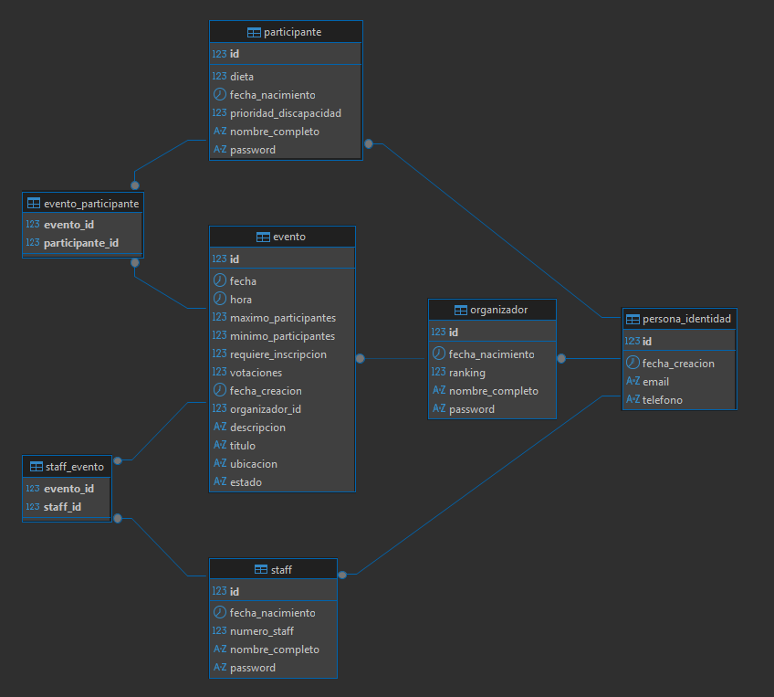

# Plataforma de Gestión de Eventos Comunitarios - Azaila
## 1. Descripción del Proyecto

Este proyecto es el **backend** de una plataforma para la gestión de eventos comunitarios en Azaila, Teruel.  
Permite a los usuarios crear, organizar, participar y colaborar en eventos locales, fomentando la vida social y la interacción en la comunidad.

La aplicación está desarrollada con **Java 17** y **Spring Boot**, usando **Spring Data JPA** para la persistencia en **MySQL**.  
Sigue el patrón **MVC** y está estructurada en capas: Model, Controller, Service, Repository, DTO, Config y Exception.

---

## 2. Modelo de Datos y Relaciones

El diseño se basa en las siguientes entidades principales:

- **Persona** (`abstract`): Clase base para todos los usuarios, con información personal y una relación uno a uno con `PersonaIdentidad` (email y teléfono únicos).
- **PersonaIdentidad**: Almacena la identidad única de cada persona (email, teléfono).
- **Organizador**: Hereda de `Persona`. Usuario que puede crear y organizar eventos.
- **Staff**: Hereda de `Persona`. Usuario que colabora en la organización de eventos.
- **Participante**: Hereda de `Persona`. Usuario que participa en eventos.
- **Evento**: Representa un evento comunitario, con relaciones a organizador, staff y participantes.

### Relaciones

- **Herencia**: `Organizador`, `Staff` y `Participante` heredan de `Persona`.
- **Persona ↔ PersonaIdentidad**: Relación uno a uno, garantizando unicidad de email y teléfono.
- **Evento → Organizador**: Un evento tiene un organizador (`@ManyToOne`).
- **Evento ↔ Staff**: Un evento puede tener varios miembros del staff (`@ManyToMany`).
- **Evento ↔ Participante**: Un evento puede tener varios participantes (`@ManyToMany`).

**Importante:**  
Una persona puede tener diferentes roles en distintos eventos, pero nunca más de un rol en el mismo evento.



### Estructura del Proyecto
```
├───src
│   ├───main
│   │   ├───java
│   │   │   └───azaila
│   │   │       └───community
│   │   │           ├───config
│   │   │           ├───controller
│   │   │           ├───dto
│   │   │           │   ├───evento
│   │   │           │   ├───organizador
│   │   │           │   ├───participante
│   │   │           │   └───staff
│   │   │           ├───enums
│   │   │           ├───exception
│   │   │           ├───model
│   │   │           ├───repository
│   │   │           └───service
│   │   │               ├───impl
│   │   │               └───interfaces
│   │   └───resources
│   │       ├───static
│   │       └───templates
│   └───test
│       └───java
│           └───azaila
│               └───community
```
---

## 3. Configuración y Setup

1. **Clona el repositorio:**
   ```bash
   git clone <URL_DEL_REPOSITORIO>
   ```
2. **Configura la base de datos MySQL:**
   - Crea una base de datos llamada `azaila_events`.
   - Actualiza las credenciales en `src/main/resources/application.properties`:
     ```properties
     spring.datasource.url=jdbc:mysql://localhost:TU_PUERTO/azaila_events
     spring.datasource.username=TU_USUARIO
     spring.datasource.password=TU_CONTRASEÑA
     ```
3. **Compila y ejecuta la aplicación:**
   Ejecuta la aplicación:
   - Desde el IDE (IntelliJ/Eclipse): ejecuta la clase principal AzailaCommunityApplication.
   - Desde consola con Maven:
     ```bash
     mvn spring-boot:run
     ```
La API estará disponible en: http://localhost:8080

## 4. Tecnologías utilizadas:
   - Java 17
   - Spring Boot
   - Spring Data JPA
   - MySQL
   - Maven
   - Lombok
   - Swagger (para documentación de la API)
   - JUnit y Mockito (para pruebas unitarias)
   - Git y GitHub (control de versiones)

## 5. Controladores y Rutas REST
La API se estructura en controladores por entidad, siguiendo buenas prácticas REST. Se contemplan endpoints para listar, crear, actualizar y eliminar entidades, así como para gestionar la relación muchos a muchos entre personas y eventos.
- OrganizadorController (/api/v1/organizadores)
- StaffController (/api/v1/staff)
- ParticipanteController (/api/v1/participantes)
- EventoController (/api/v1/eventos)
- - GET / → Listar todos los eventos
- - GET /{id} → Obtener evento por ID
- - POST / → Crear evento
- - PATCH /{id} → Actualizar evento
- - DELETE /{id} → Eliminar evento
- - POST /{eventoId}/apuntarse/{participanteId} → Añadir participante a un evento
- - DELETE /{eventoId}/desapuntarse/{participanteId} → Quitar participante de un evento
- - POST /{eventoId}/staff/{staffId} → Añadir staff a un evento
- - DELETE /{eventoId}/staff/{staffId} → Quitar staff de un evento
## 6. Enlaces
- [Repositorio GitHub](<URL_DEL_REPOSITORIO>)
- [Documentación Swagger](http://localhost:8080/swagger-ui.html) (una vez la aplicación esté en ejecución)
- [Diagrama UML](./docs/diagrama_uml.png)
- [Enlace a la presentación](<URL_DE_LA_PRESENTACION>)
## 7. Autor
  - Nombre: [Carolina Romero]
